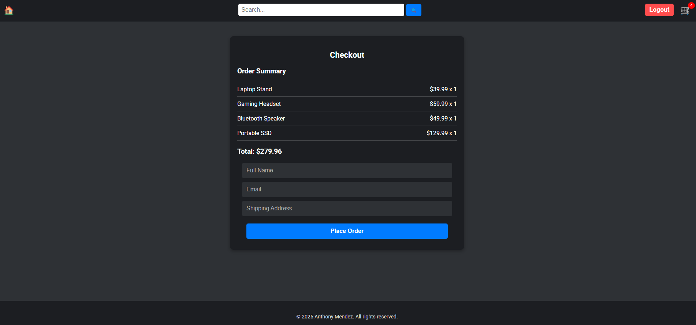
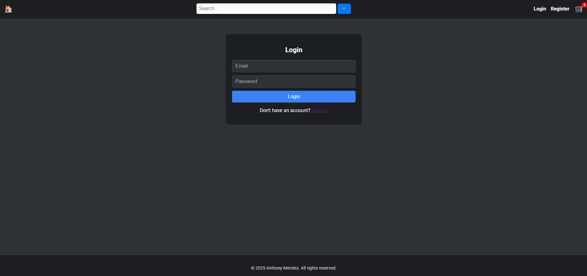

# My E-Commerce App

## Screenshots






# Steps to use the website

# 1. Clone the repository
```bash
  git clone https://github.com/Antheagao/ecommerce-app.git
```
# 2. Install dependencies
```bash
  cd frontend
  npm install
```
```bash
  cd backend
  mvn clean install
```

# 3. Setup a postgresql database
  * create a postgresql database
  * create tables for cart, order, orderitem, product, user

# 4. Start the backend server
```bash
  cd backend
  mvn spring-boot:run
```

#5 Start the frontend server
```bash
  cd frontend
  npm start
```

#6 Go to the homepage on a web browser
```bash
  http://localhost:3000
```
